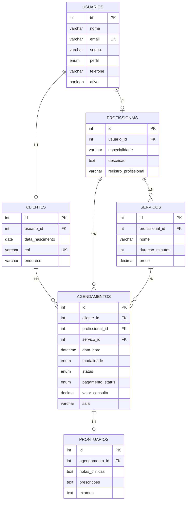
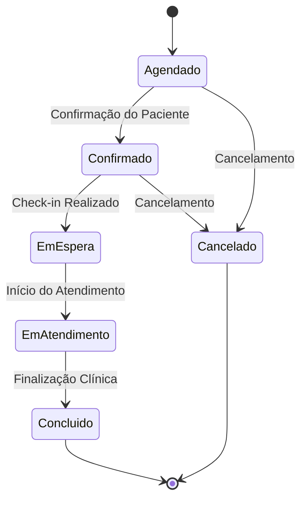

<p align="center">
  
  
  
  
</p>

<h1 align="center">Clínica Vita — API REST</h1>

<p align="center">
  <strong>Infraestrutura de backend para gestão de clínicas médicas</strong><br/>
  Agendamento dinâmico · Prontuários eletrônicos · Gestão financeira · Controle de acesso avançado
</p>

<p align="center">
  
  
  
  
</p>

---

## Início Rápido

```bash
# 1. Instalação de dependências
npm install

# 2. Configuração de variáveis de ambiente
cp .env.example .env     # Configure as credenciais do MySQL no arquivo .env

# 3. Inicialização da estrutura do banco de dados
mysql -u root -p < database/schema.sql
mysql -u root -p < database/seed.sql

# 4. Execução do servidor
npm run dev              # Modo desenvolvimento (nodemon)
npm start                # Modo produção
```

### Configurações de Ambiente

A API é compatível com os principais provedores de infraestrutura como Railway, Render e Heroku.

| Variável | Alternativa | Descrição |
|:---------|:------------|:----------|
| `DB_HOST` | `MYSQL_HOST` | Endereço do servidor MySQL |
| `DB_PORT` | `MYSQL_PORT` | Porta de conexão (Padrão: 3306) |
| `DB_USER` | `MYSQL_USERNAME` | Usuário de autenticação |
| `DB_PASS` | `MYSQL_PASSWORD` | Senha de acesso |
| `DB_NAME` | `MYSQL_DATABASE` | Nome do banco de dados |
| — | `DATABASE_URL` | String de conexão completa |

> Nota: Defina `DEBUG_DB_CONFIG=true` para habilitar logs detalhados de conexão.

---

## Arquitetura de Dados

O sistema utiliza **MySQL 8** com codificação `utf8mb4`. O esquema detalhado pode ser encontrado em [`database/schema.sql`](database/schema.sql).

### Diagrama de Entidade-Relacionamento



---

### Dicionário de Dados

<details>
<summary><strong>usuarios</strong> — Base de Autenticação</summary>

| Coluna | Tipo | Descrição |
|:-------|:-----|:----------|
| `id` | `INT` PK | Identificador único |
| `nome` | `VARCHAR(100)` | Nome completo |
| `email` | `VARCHAR(100)` | Login do usuário (Único) |
| `senha` | `VARCHAR(255)` | Hash criptográfico (Bcrypt) |
| `perfil` | `ENUM` | `admin` · `profissional` · `cliente` · `recepcionista` |
| `telefone` | `VARCHAR(20)` | Contato telefônico |
| `ativo` | `BOOLEAN` | Status da conta |

</details>

<details>
<summary><strong>profissionais</strong> — Corpo Clínico</summary>

| Coluna | Tipo | Descrição |
|:-------|:-----|:----------|
| `id` | `INT` PK | Identificador do profissional |
| `usuario_id` | `INT` FK | Relacionamento com tabela usuarios |
| `especialidade` | `VARCHAR(100)` | Área de atuação médica |
| `descricao` | `TEXT` | Perfil profissional |
| `registro_profissional` | `VARCHAR(50)` | CRM / CRP / Registro de classe |

</details>

<details>
<summary><strong>clientes</strong> — Cadastro de Pacientes</summary>

| Coluna | Tipo | Descrição |
|:-------|:-----|:----------|
| `id` | `INT` PK | Identificador do paciente |
| `usuario_id` | `INT` FK | Relacionamento com tabela usuarios |
| `data_nascimento` | `DATE` | Data de nascimento |
| `cpf` | `VARCHAR(14)` | Cadastro de Pessoa Física (Único) |
| `endereco` | `VARCHAR(255)` | Endereço residencial |

</details>

<details>
<summary><strong>servicos</strong> — Procedimentos Clínicos</summary>

| Coluna | Tipo | Descrição |
|:-------|:-----|:----------|
| `id` | `INT` PK | Identificador do serviço |
| `profissional_id` | `INT` FK | Responsável técnico |
| `nome` | `VARCHAR(100)` | Nome do procedimento |
| `duracao_minutos` | `INT` | Tempo estimado (Padrão: 30) |
| `preco` | `DECIMAL(10,2)` | Valor nominal |

</details>

<details>
<summary><strong>agendamentos</strong> — Gestão de Consultas</summary>

| Coluna | Tipo | Descrição |
|:-------|:-----|:----------|
| `id` | `INT` PK | Identificador do agendamento |
| `cliente_id` | `INT` FK | Paciente |
| `profissional_id` | `INT` FK | Profissional alocado |
| `servico_id` | `INT` FK | Procedimento |
| `data_hora` | `DATETIME` | Cronograma da consulta |
| `modalidade` | `ENUM` | `presencial` · `teleconsulta` |
| `link_telemedicina` | `VARCHAR(255)` | URL de acesso remoto |
| `notificado` | `BOOLEAN` | Confirmação de envio de alerta |
| `status` | `ENUM` | Ciclo operacional (Agendado, Confirmado, Concluído, etc.) |
| `pagamento_status` | `ENUM` | `pendente` · `pago` |
| `valor_consulta` | `DECIMAL(10,2)` | Valor faturado |
| `sala` | `VARCHAR(20)` | Local físico ou virtual |

#### Fluxo de Status do Agendamento



</details>

---

## Documentação de Endpoints

### Rotas Públicas (Acesso Aberto)

| Método | Endpoint | Função |
|:------:|:---------|:----------|
| `POST` | `/api/login` | Autenticação e emissão de token JWT |
| `POST` | `/api/registro` | Autopreenchimento de novo paciente |
| `GET` | `/api/profissionais` | Consulta ao corpo clínico |
| `GET` | `/api/servicos` | Listagem de procedimentos disponíveis |

### Rotas Privadas (Requer Autenticação JWT)

| Método | Endpoint | Nível de Acesso | Descrição |
|:------:|:---------|:-------|:----------|
| `POST` | `/api/profissionais` | Admin | Inclusão de novo profissional |
| `POST` | `/api/servicos` | Admin / Profissional | Cadastro de novos serviços |
| `GET` | `/api/clientes` | Admin / Prof / Recepção | Gestão da base de pacientes |
| `GET` | `/api/agendamentos` | Autenticado | Gestão de consultas (Filtrado por perfil) |
| `POST` | `/api/agendamentos` | Cliente / Recepção / Admin | Criação de reserva (Validação de conflitos) |
| `PUT` | `/api/agendamentos/:id` | Autenticado | Atualização de status operacional |
| `GET` | `/api/prontuarios/:id` | Profissional / Admin | Acesso a dados clínicos |
| `POST` | `/api/prontuarios/:id` | Profissional / Admin | Registro de evolução clínica |

---

## Integridade e Segurança

| Regra | Definição Técnica |
|:------|:----------|
| **Remoção em Cascata** | A exclusão de um usuário implica na remoção automatizada de seus registros dependentes. |
| **Prevenção de Conflitos** | Algoritmo de validação de slots para evitar sobreposição de agendas. |
| **Controle de Acesso (RBAC)** | Middleware de validação de escopo baseado no perfil do token JWT. |
| **Unicidade de Dados** | Garantia de integridade para campos de e-mail e identificadores nacionais (CPF). |

---

## Credenciais de Referência (Ambiente de Teste)

Senha padrão para homologação: **`123456`**

| Perfil | Identificação | E-mail |
|:-------|:-----|:-------|
| Administrador | Administrador Vita | `admin@clinica.com` |
| Médico | Dra. Ana Silva | `ana.silva@clinica.com` |
| Médico | Dr. Roberto Santos | `roberto.santos@clinica.com` |
| Paciente | Maria Santos | `maria.santos@email.com` |
| Recepção | Patrícia Staff | `recepcao@clinica.com` |

---

<p align="center">
  Desenvolvido para <strong>Clínica Vita</strong> — VitalHub Enterprise Platform
</p>
