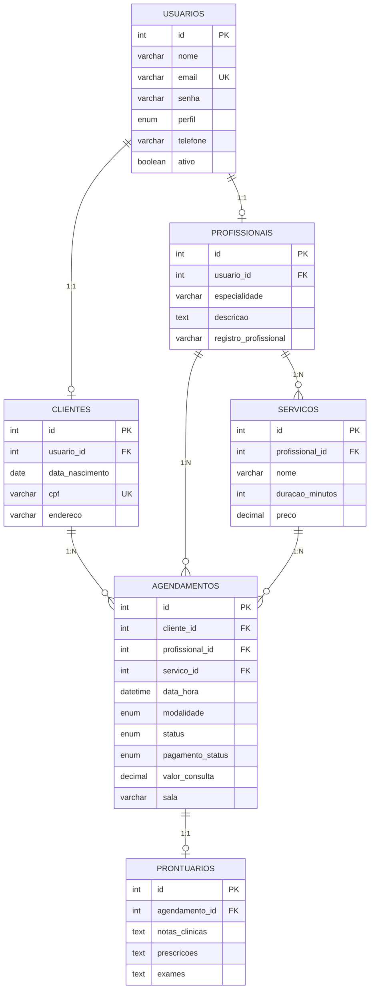
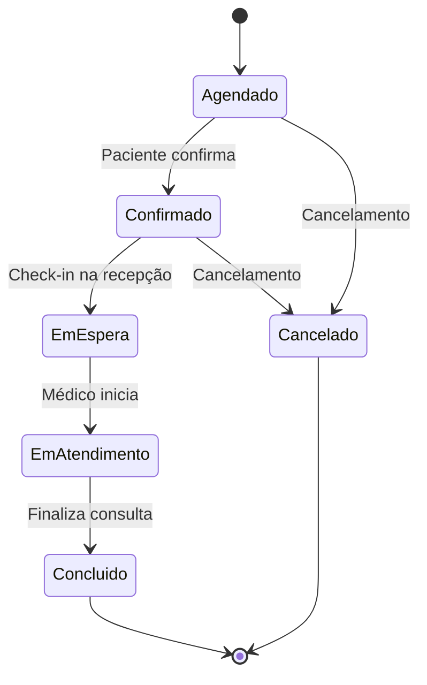

<p align="center">
  
  
  
  
</p>

<h1 align="center">🏥 Clínica Vita — API REST</h1>

<p align="center">
  <strong>Backend robusto para gestão completa de clínicas médicas</strong><br/>
  Agendamento inteligente · Prontuários digitais · Controle financeiro · RBAC avançado
</p>

<p align="center">
  
  
  
  
</p>

---

## ⚡ Quick Start

```bash
# 1. Instalar dependências
npm install

# 2. Configurar variáveis de ambiente
cp .env.example .env     # Editar com suas credenciais MySQL

# 3. Criar e popular o banco
mysql -u root -p < database/schema.sql
mysql -u root -p < database/seed.sql

# 4. Iniciar
npm run dev              # Desenvolvimento (nodemon)
npm start                # Produção
```

### 🔐 Variáveis de Ambiente

> Compatível com Railway, Render, Heroku e similares.

| Variável | Alternativa | Descrição |
|:---------|:------------|:----------|
| `DB_HOST` | `MYSQL_HOST` | Host do servidor MySQL |
| `DB_PORT` | `MYSQL_PORT` | Porta (default: 3306) |
| `DB_USER` | `MYSQL_USERNAME` | Usuário |
| `DB_PASS` | `MYSQL_PASSWORD` | Senha |
| `DB_NAME` | `MYSQL_DATABASE` | Nome do banco |
| — | `DATABASE_URL` / `MYSQL_URL` | Connection string completa |

> 💡 Defina `DEBUG_DB_CONFIG=true` para logs de debug de conexão.

---

## 🗄️ Arquitetura do Banco de Dados

O sistema utiliza **MySQL 8+** com charset `utf8mb4`. Schema em [`database/schema.sql`](database/schema.sql).

### 🔗 Diagrama de Relacionamentos



---

### 📋 Detalhamento das Tabelas

<details>
<summary>👤 <strong>usuarios</strong> — Autenticação centralizada</summary>

| Coluna | Tipo | Descrição |
|:-------|:-----|:----------|
| `id` | `INT` PK | Identificador único auto-increment |
| `nome` | `VARCHAR(100)` | Nome completo do usuário |
| `email` | `VARCHAR(100)` 🔑 | E-mail único (usado como login) |
| `senha` | `VARCHAR(255)` | Hash bcrypt da senha |
| `perfil` | `ENUM` | 🔴 `admin` · 🟢 `profissional` · 🔵 `cliente` · 🟠 `recepcionista` |
| `telefone` | `VARCHAR(20)` | Contato telefônico |
| `ativo` | `BOOLEAN` | `true` = ativo no sistema |

</details>

<details>
<summary>🩺 <strong>profissionais</strong> — Corpo clínico</summary>

| Coluna | Tipo | Descrição |
|:-------|:-----|:----------|
| `id` | `INT` PK | ID do profissional |
| `usuario_id` | `INT` FK 🔑 | Vínculo único com `usuarios` |
| `especialidade` | `VARCHAR(100)` | Ex: "Clínica Geral", "Psiquiatria" |
| `descricao` | `TEXT` | Mini biografia / currículo |
| `registro_profissional` | `VARCHAR(50)` | CRM / CRP / CREFITO |

</details>

<details>
<summary>🧑‍🤝‍🧑 <strong>clientes</strong> — Pacientes</summary>

| Coluna | Tipo | Descrição |
|:-------|:-----|:----------|
| `id` | `INT` PK | ID do paciente |
| `usuario_id` | `INT` FK 🔑 | Vínculo único com `usuarios` |
| `data_nascimento` | `DATE` | Data de nascimento |
| `cpf` | `VARCHAR(14)` 🔑 | CPF formatado (único) |
| `endereco` | `VARCHAR(255)` | Endereço completo |

</details>

<details>
<summary>📦 <strong>servicos</strong> — Catálogo de procedimentos</summary>

| Coluna | Tipo | Descrição |
|:-------|:-----|:----------|
| `id` | `INT` PK | ID do serviço |
| `profissional_id` | `INT` FK | Médico responsável |
| `nome` | `VARCHAR(100)` | Ex: "Consulta Geral", "Psicoterapia" |
| `descricao` | `TEXT` | Detalhes do procedimento |
| `duracao_minutos` | `INT` | Duração (default: 30min) |
| `preco` | `DECIMAL(10,2)` | Valor em R$ |

</details>

<details>
<summary>📅 <strong>agendamentos</strong> — Fila e controle de consultas</summary>

| Coluna | Tipo | Descrição |
|:-------|:-----|:----------|
| `id` | `INT` PK | ID do agendamento |
| `cliente_id` | `INT` FK | Paciente vinculado |
| `profissional_id` | `INT` FK | Médico alocado |
| `servico_id` | `INT` FK | Serviço escolhido |
| `data_hora` | `DATETIME` | Data e hora exata da consulta |
| `modalidade` | `ENUM` | 🏢 `presencial` · 📹 `teleconsulta` |
| `link_telemedicina` | `VARCHAR(255)` | URL Zoom / Meet (se teleconsulta) |
| `notificado` | `BOOLEAN` | Se lembrete automático foi enviado |
| `status` | `ENUM` | Ciclo de vida (ver diagrama abaixo) |
| `pagamento_status` | `ENUM` | 🔴 `pendente` · 🟢 `pago` |
| `valor_consulta` | `DECIMAL(10,2)` | Valor cobrado |
| `sala` | `VARCHAR(20)` | Sala física ou `"VIRTUAL"` |
| `observacoes` | `TEXT` | Notas do paciente / recepção |

#### 🔄 Ciclo de Vida do Agendamento



</details>

<details>
<summary>📝 <strong>prontuarios</strong> — Registro clínico digital</summary>

| Coluna | Tipo | Descrição |
|:-------|:-----|:----------|
| `id` | `INT` PK | ID do prontuário |
| `agendamento_id` | `INT` FK 🔑 | Vínculo 1:1 com agendamento |
| `notas_clinicas` | `TEXT` | Anotações SOAP do médico |
| `prescricoes` | `TEXT` | Receituário digital |
| `exames` | `TEXT` | Solicitações de exames |

</details>

### ⚡ Índices de Performance

| Índice | Tabela | Colunas | Finalidade |
|:-------|:-------|:--------|:-----------|
| `idx_agendamentos_data` | agendamentos | `data_hora` | Busca rápida por dia |
| `idx_agendamentos_profissional` | agendamentos | `profissional_id, data_hora` | Agenda do médico |
| `idx_agendamentos_cliente` | agendamentos | `cliente_id, data_hora` | Histórico do paciente |

### 🔐 Regras de Integridade

| Regra | Descrição |
|:------|:----------|
| 🗑️ **Cascade Delete** | Remover `usuario` → exclui automaticamente profissional/cliente/serviços/agendamentos/prontuários |
| 🚫 **Anti-conflito (Profissional)** | API impede agendamentos sobrepostos para o mesmo médico |
| 🚫 **Anti-conflito (Paciente)** | API impede que o paciente tenha 2 consultas simultâneas |
| 🔒 **RBAC Centralizado** | O campo `perfil` controla rotas, menus e filtros de dados |
| 🔑 **Unicidade** | E-mails e CPFs são garantidos como únicos no banco |

---

## 🛣️ Endpoints da API

### 🔓 Públicos (sem autenticação)

| Método | Endpoint | Descrição |
|:------:|:---------|:----------|
| `POST` | `/api/login` | 🔐 Autenticação e retorno do JWT |
| `POST` | `/api/registro` | 📝 Registro de novo paciente |
| `GET` | `/api/profissionais` | 🩺 Listar corpo clínico |
| `GET` | `/api/servicos` | 📦 Listar serviços disponíveis |
| `POST` | `/api/clientes` | 👤 Cadastro de cliente |

### 🔒 Protegidos (requer JWT)

| Método | Endpoint | Acesso | Descrição |
|:------:|:---------|:-------|:----------|
| `POST` | `/api/profissionais` | 🔴 Admin | Cadastrar novo profissional |
| `POST` | `/api/servicos` | 🔴🟢 Admin/Prof | Cadastrar serviço |
| `GET` | `/api/clientes` | 🔴🟢🟠 Admin/Prof/Recepção | Listar clientes (filtrado por perfil) |
| `GET` | `/api/clientes/meu-historico` | 🔵🟢🔴 Todos logados | Histórico de saúde |
| `GET` | `/api/agendamentos` | 🔓 Todos logados | Listar agendamentos (filtrado) |
| `GET` | `/api/agendamentos/disponibilidade` | 🔓 Todos logados | Horários ocupados do dia |
| `POST` | `/api/agendamentos` | 🔵🟠🔴 Cliente/Recep/Admin | Criar agendamento *(com anti-conflito)* |
| `PUT` | `/api/agendamentos/:id` | 🔓 Todos logados | Atualizar status/dados |
| `DELETE` | `/api/agendamentos/:id` | 🔓 Todos logados | Cancelar (soft delete) |
| `GET` | `/api/prontuarios/:agendamento_id` | 🟢🔴 Prof/Admin | Buscar prontuário |
| `POST` | `/api/prontuarios/:agendamento_id` | 🟢🔴 Prof/Admin | Salvar prontuário |

---

## 🛡️ Matriz de Controle de Acesso (RBAC)

| Recurso | 🔴 Admin | 🟠 Recepção | 🟢 Profissional | 🔵 Cliente |
|:--------|:--------:|:-----------:|:---------------:|:----------:|
| Hub Operacional | ✅ | ✅ | ❌ | ❌ |
| Agenda Global | ✅ | ✅ | ❌ | ❌ |
| Agendar (por paciente) | ✅ | ✅ | ❌ | ❌ |
| Cadastrar Paciente | ✅ | ✅ | ❌ | ❌ |
| Painel Médico | ✅ | ❌ | ✅ | ❌ |
| Sala de Atendimento | ✅ | ❌ | ✅ | ❌ |
| Meus Pacientes | ❌ | ❌ | ✅ *(filtrado)* | ❌ |
| Minhas Consultas | ❌ | ❌ | ✅ | ✅ |
| Auto-agendamento | ❌ | ❌ | ❌ | ✅ |
| Gerenciar Usuários | ✅ | ❌ | ❌ | ❌ |

---

## 🧪 Credenciais de Teste

> Seed completo em [`database/seed.sql`](database/seed.sql) — Senha universal: **`123456`**

| Perfil | Nome | E-mail | Função |
|:-------|:-----|:-------|:-------|
| 🔴 Admin | Administrador Vita | `admin@clinica.com` | Visão total do sistema |
| 🟢 Profissional | Dra. Ana Silva | `ana.silva@clinica.com` | Clínica Geral |
| 🟢 Profissional | Dr. Roberto Santos | `roberto.santos@clinica.com` | Psiquiatria |
| 🔵 Cliente | Maria Santos | `maria.santos@email.com` | Paciente de teste |
| 🟠 Recepcionista | Patrícia Staff | `recepcao@clinica.com` | Triagem e agendamentos |

---

<p align="center">
  <sub>Desenvolvido com 💚 para <strong>Clínica Vita</strong> — VitalHub Enterprise Platform</sub>
</p>
